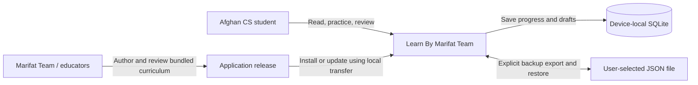
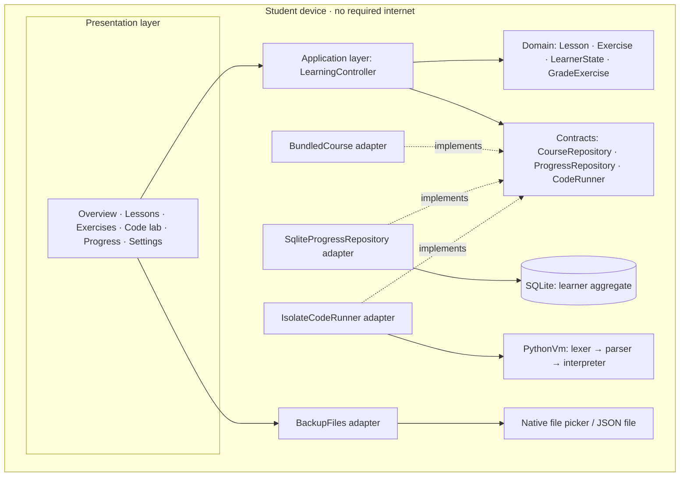
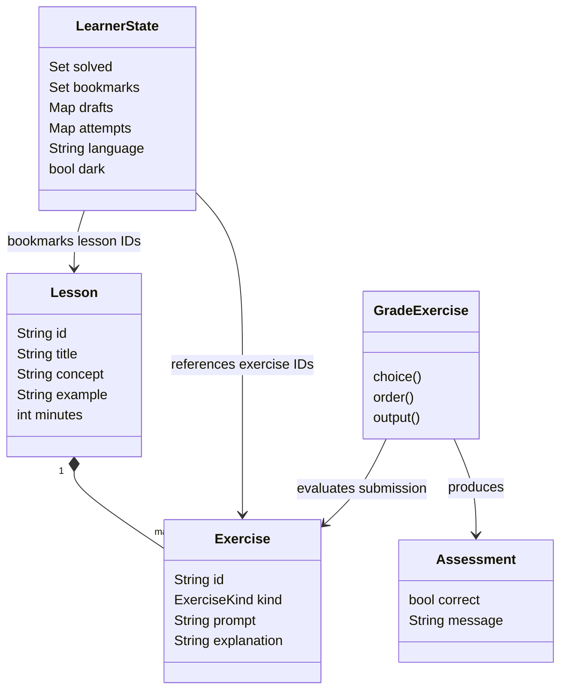
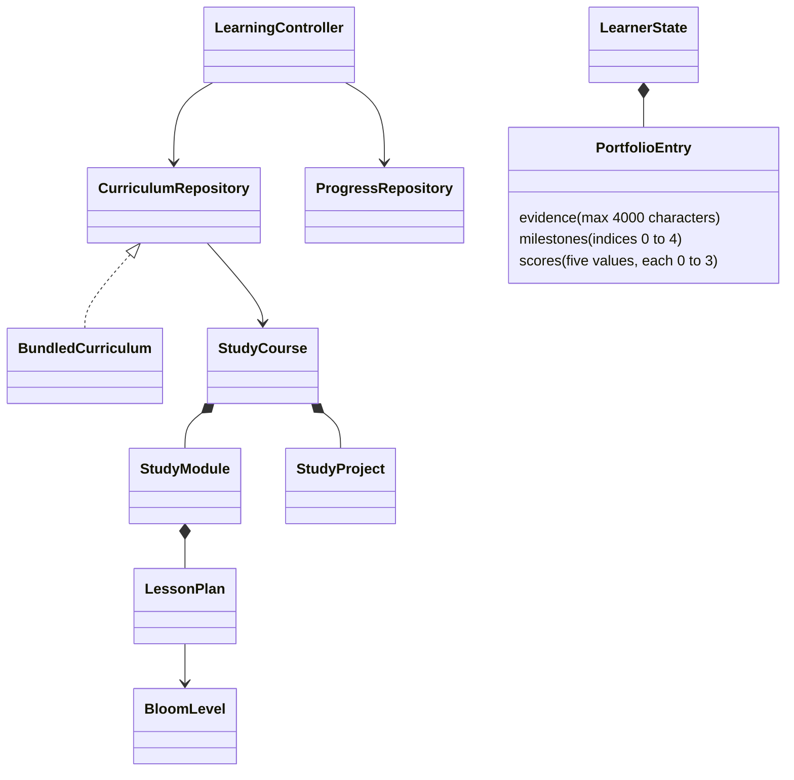
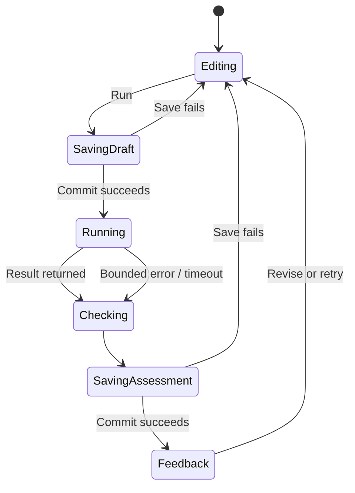

# Learn By Marifat Team
## Software architecture specification · version 1.1

**Product:** Learn By Marifat Team  
**Team:** Marifat Team  
**Purpose:** programming education for Afghan computer science students  
**Primary constraint:** every core learning activity works fully offline  
**Implementation:** Flutter / Dart, bundled curriculum, SQLite, bounded Python teaching interpreter

This specification describes the implemented application. Proposed extensions are identified explicitly. See [the overview diagram](architecture.svg), [engineering decisions](ENGINEERING.md), and [verification evidence](VERIFICATION.md).

## 1. Architectural drivers

| Driver | Architectural response | Acceptance evidence |
|---|---|---|
| Unreliable or unavailable connectivity | Package lessons, fonts, grading, and the code runner inside the app; local storage is authoritative | No first-run content download; no remote compiler; Android manifest removes network permissions |
| Beginner programming practice | Worked examples → prediction → code ordering → small coding tasks | Seven lessons and 21 exercises |
| Multi-course study | Immutable catalog → modules → Bloom-aligned plans → practical projects | 20 courses, 320 plans, 60 project assignments; prerequisite and coverage tests |
| Evidence-based reflection | Portfolio entries with milestones and five rubric dimensions | Local SQLite persistence and version-1 backup migration tests |
| Protect learner progress | Immutable learner aggregate, validated commands, serialized writes, SQLite transactions | Failed-write, concurrency, backup, and reopen tests |
| Keep the UI responsive | Execute student code in an isolate with bounded resources | Step, value, recursion, output, and worker-timeout limits |
| Maintainability | Domain contracts separate learning policy from adapters and views | Constructor injection and substitute test adapters |
| Local relevance | Support translated navigation and keep course text separable from UI | English/Dari/Pashto inventoried curriculum translations; native-language and educator review remain pending |

## 2. System context



The student needs the installed application and a functioning device. There is no application server, login provider, analytics service, or required classroom network. Native file pickers may expose providers installed by the user; selecting a local folder permits fully offline backup. Curriculum authoring happens in the source/release process, not in a currently implemented teacher portal.

## 3. Architecture style and dependency rules

The application is a **layered client application with ports and adapters**. It has one deployable application and a worker isolate, not microservices. It uses observable application state with Flutter views; `LearningController` is a shared coordinator, not a separate view model for every screen.



Rules:

1. Domain models and grading do not import Flutter widgets, SQLite, or native plugins.
2. Application commands depend on repository/runner contracts. Adapters are supplied at the composition root.
3. Views display state and invoke commands; they do not issue SQL or grade submissions.
4. Native backup file selection belongs to the settings workflow. Imported data is validated by the application before persistence.
5. The runtime has no host-code evaluation, imports, filesystem access, or network built-ins.
6. `main.dart` selects the appropriate platform database factory and handles startup failure without erasing data.

## 4. Components and source mapping

| Component | Source | Responsibility |
|---|---|---|
| Composition root | `lib/main.dart` | Initialize platform services; inject adapters; open local state |
| App shell / feature views | `lib/presentation/app.dart` | Navigation, library search, progress, preferences, backup workflow |
| Lesson and exercise views | `lib/presentation/lesson_screen.dart` | Reading, choices, and code-ordering interaction |
| Code workbench | `lib/presentation/code_workbench.dart` | Editor, explicit save, run, output, hints, feedback |
| Application coordinator | `lib/application/learning_controller.dart` | Submit, grade, serialize commits, expose progress, restore backups |
| Course domain | `lib/domain/course.dart` | Lessons, exercises, kinds, course contract |
| Assessment policy | `lib/domain/assessment.dart` | Choice, order, and output comparison |
| Learner aggregate / codec | `lib/domain/learner_state.dart` | Immutable state and validated versioned serialization |
| Bundled curriculum | `lib/data/bundled_course.dart` | Seven original lessons, always available |
| Curriculum contract and models | `lib/domain/curriculum.dart` | Course, module, Bloom level, lesson plan, project, repository port |
| Generated catalog adapter | `lib/data/bundled_curriculum.dart` | Immutable compiled-in 20-course catalog |
| Portfolio value object | `lib/domain/portfolio.dart` | Bounded evidence, milestones, rubric, validated serialization |
| Curriculum and portfolio views | `lib/presentation/curriculum_screen.dart` | Search, prerequisites, plans, project briefs, evidence editing |
| Curriculum authoring | `tool/build_curriculum.py` | One authoring source generates Dart, JSON, and Markdown plans |
| Persistence adapter | `lib/data/sqlite_progress_repository.dart` | Transactional local load/save |
| Backup transport | `lib/data/backup_files.dart` | Native selection, bounded reads, UTF-8 export |
| Execution adapter / engine | `lib/runtime/code_runner.dart`, `python_vm.dart` | Worker lifecycle and bounded teaching interpreter |

## 5. Domain model



Core invariants: solved IDs and bookmark IDs must exist in the bundled course; attempts are bounded nonnegative integers; drafts are bounded strings associated with an exercise or the playground. A correct retry does not duplicate credit. An incorrect retry does not remove previously earned completion. A runtime error never earns credit from partial matching output.

## 6. Persistence and consistency

```sql
CREATE TABLE learner (
  id INTEGER PRIMARY KEY CHECK (id = 1),
  payload TEXT NOT NULL
);
```

SQLite schema version 1 stores one bounded learner aggregate in one row. JSON payload version 3 contains solved IDs, bookmarks, drafts, attempts, language, appearance, and portfolio entries. Legacy version-1 JSON loads with an empty portfolio and is upgraded on the next save; no SQL migration is needed because the table structure is unchanged. The controller validates the next state, the repository commits it transactionally, and only then does the controller publish the state to the views.

```mermaid
sequenceDiagram
  actor Student
  participant UI
  participant App as LearningController
  participant DB as SQLite adapter
  participant Worker as Runner isolate
  Student->>UI: Run and check
  UI->>App: submitCode(exercise, source)
  App->>DB: Save draft
  DB-->>App: Commit succeeds
  App->>Worker: Run source
  Worker-->>App: Output / error
  App->>App: Grade; derive immutable next state
  App->>DB: Save attempts and completion
  DB-->>App: Commit succeeds
  App-->>UI: Publish state and feedback
```

The two commits intentionally protect the draft even if execution or the final progress save fails. They are not one transaction spanning the isolate. A single Future queue serializes local read-modify-write commands; failures are returned to the caller and later commands can still proceed. This is single-client consistency, not a distributed synchronization protocol.

## 7. Backup and restore boundary

Export waits for pending commits and serializes the saved aggregate. Import reads at most 16 MB, validates the format/version, field types, IDs, and limits, then presents a replacement confirmation. A confirmed restore commits atomically and refreshes editors from restored drafts. Backup files are readable JSON; encryption and tamper-proof examination scores are not claimed.

**Rename compatibility:** the display name and Dart package are updated. The Android application ID `org.afghanlearn.kohi`, database filename `kohi.db`, and `kohi-backup` format marker remain stable. JSON versions 1 and 2 are accepted; exports use version 2. Windows continues using its established `org.afghanlearn/kohi` support directory. New exported filenames use `learn-by-marifat-team-backup.json`.

## 7a. Implemented curriculum and portfolio extension



`Bootstrap` injects the same curriculum into the controller and persistence adapter. Domain and application logic do not import the concrete catalog. The repository returns immutable collections. Course prerequisites are navigable suggestions; no artificial lock prevents a student from reviewing advanced material. Tests reject missing prerequisite references and cycles in the bundled catalog.

The legacy `CourseRepository` remains the interactive Python foundation exercise port, preserving all original exercise IDs. `CurriculumRepository` describes the wider study pathways. Their separate result semantics are deliberate: matching Python output can earn an exercise result; a project requires external source and evidence review. Self-reported milestones never increment automatically graded completion.

Portfolio save follows the existing serialized commit pipeline. Known lesson-plan and project IDs are allowed; unknown IDs, invalid rubric values, and oversized evidence are rejected. The whole encoded backup is limited to 16 MB in UTF-8, including non-Latin text. Native file import has the same byte cap. Failed writes leave the visible persisted state unchanged and the editor available for retry. Leaving a dirty portfolio editor requires an explicit discard decision; abrupt process termination can still lose unsaved edits.

The curriculum generator emits a compiled Dart payload, distributable JSON, and an educator Markdown document. Learner runtime reads compiled data without filesystem downloads. Content changes ship with app releases. Stable IDs are part of the persistence contract; deleting or renaming an ID requires an explicit migration, not a cosmetic content edit.

Every course has 16 modules, 32 session plans, and 3 progressively larger project assignments. Plans contain objectives, time allocation, activities, and assessment evidence. Rubric dimensions are correctness, design, verification, usability/accessibility, and reproducibility. This implements a curriculum and portfolio system, not an automated judge for arbitrary languages or an accreditation system.

External project toolchains are outside the application process. The app never invokes a shell, compiler, local HTTP service, or SDK on behalf of curriculum content. Students use provisioned tools themselves. React/Node/Express exercises can run against loopback services on a disconnected workstation. Native iOS work requires a compatible Mac/Xcode. Such development is distinct from reading all curricula offline on the learner's device.

## 8. Execution and safety



The language is a documented Python subset, not full CPython. It supports the constructs used in the course. Limits include 12,000 source characters, 20,000 execution steps, 1,000 list/range items, bounded nested values, 16,000 output characters, a 32-call depth cap, and a three-second worker timeout. Each run starts with fresh variables. The host kills the isolate when execution finishes or times out.

Code tasks compare displayed output. They support learning practice; they do not verify that a particular algorithm was used and cannot serve as secure exams.

## 9. Deployment

| Target | Bundle | Local dependencies | Status |
|---|---|---|---|
| Android | APK with Flutter engine, app code, fonts, curriculum, and plugins | Device storage and OS file picker | Source configured; APK build and physical-device offline acceptance pending |
| Windows | EXE, Flutter/native DLLs, and `data` folder | Windows runtime and local storage | Renamed application passes native startup, local-save, and execution integration checks |

Developer machines may require internet to fetch SDKs, Gradle, and packages. That does not add a runtime network dependency for students. Updates are distributed as application releases; arbitrary executable plugin or curriculum-pack import is not implemented.

## 10. Quality and change management

Use static analysis, formatting, domain/runtime tests, SQLite integration, widget interaction/visual checks, and native startup tests. The codebase contains 74 automated tests plus a Windows native test. Consult the verification report for the last executed results rather than treating test counts as proof of every platform's readiness.

For each future feature: define its learner outcome, state/data invariants, dependency boundary, failure behavior, migration requirements, and acceptance tests. Add an architecture decision record when changing persistence, execution, distribution, or trust boundaries.

## 11. Future extensions — not implemented

- Educator-reviewed Dari/Pashto curriculum and accessibility evaluation with local students.
- Full CPython through a new `CodeRunner` adapter, with native packaging and a separately assessed execution boundary.
- Signed, versioned content packs with schema validation and rollback.
- Multiple learner profiles with an explicit migration to profile-aware storage.
- Optional local classroom exchange, if requested; it must never become necessary for independent learning.

No backend, cloud compiler, AI tutor, or account system is required by this architecture.
