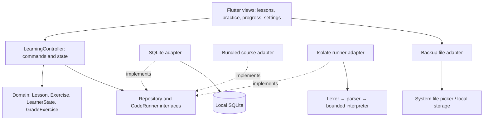

# Engineering design

## Scope and quality goals

Learn By Marifat Team is a complete introductory practice application, not a replacement for a university IDE or an implementation of every software-engineering theory. Its core invariant is: **learning and persistence never require a network**. Android is the primary delivery target; Windows is a secondary development target. There is no backend.

The app uses the separation of views, application state, repositories, and services described in [Flutter's architecture guidance](https://docs.flutter.dev/app-architecture/guide), with a pure domain layer for grading and backup contracts.

## Architecture



Source layout:

| Directory | Responsibility |
|---|---|
| `lib/domain` | Immutable entities, repository contracts, grading policy, validated backup schema |
| `lib/application` | Commands, sequential commits, read models, grading coordination |
| `lib/data` | Original bundled course, SQLite persistence, file exchange |
| `lib/runtime` | Host-independent teaching interpreter and isolate lifecycle |
| `lib/presentation` | Responsive views, reusable widgets, theme, accessibility semantics |
| `lib/main.dart` | Composition root, platform selection, failure-safe startup |

## Applied concepts and where they matter

| Concept | Concrete implementation / reason |
|---|---|
| Separation of concerns / layered architecture | UI does not issue SQL or parse Python. Domain rules can be tested without widgets. |
| Dependency inversion (SOLID) | Controller accepts `CourseRepository`, `ProgressRepository`, and `CodeRunner` contracts. Tests supply memory and synchronous adapters. |
| Single responsibility | Course, persistence, file exchange, execution, and assessment have separate components. |
| Interface segregation | Three small ports instead of a large general-purpose service. |
| Dependency injection | Constructor injection at one composition root; no global service locator. |
| Domain modeling | Lessons contain exercises; `LearnerState` is a single small learner aggregate. |
| Immutable state | Defensive unmodifiable collections and copy-on-write updates avoid hidden mutations. |
| Command/read separation | Mutating controller commands are separate from completion and next-lesson getters. This is not a distributed CQRS deployment. |
| ACID transactions | SQLite commits a validated aggregate atomically. Writes either complete or leave prior state intact. |
| Concurrency control | A Future chain serializes read-modify-write operations to prevent lost updates. A failed command does not poison later commands. |
| Idempotent achievement | Solved exercise IDs form a set. Repeated success never duplicates credit, and a later incorrect retry never removes it. Attempts still count each submission. |
| Design by contract | Backup schema, identifiers, numeric limits, language values, and draft lengths are validated before persistence. |
| Interpreter pattern | Tokenization and expression parsing produce executable statement/expression objects. The runtime invokes only its own operations. |
| Resource isolation | Runtime executes in a worker isolate; the host kills it on timeout/completion. The VM also bounds operations, nesting, values, output, and ranges. |
| Fail-safe behavior | Startup failure does not silently reset a database. UI displays success only after a confirmed save. |
| Test pyramid | Pure runtime/domain tests, real SQLite close/reopen tests, widget interaction tests, and visual baselines. |
| Traceability | Requirements below link product behavior to implementation and tests. |

## Sequence: submit a coding exercise

```mermaid
sequenceDiagram
  actor Student
  participant View
  participant Controller
  participant DB as SQLite repository
  participant Runner as Worker isolate
  Student->>View: Run & check
  View->>Controller: submitCode(exercise, source)
  Controller->>DB: Commit draft
  DB-->>Controller: Committed
  Controller->>Runner: Execute source under budgets
  Runner-->>Controller: Output or error
  Controller->>Controller: Grade output; construct next immutable state
  Controller->>DB: Commit attempts and solved IDs
  DB-->>Controller: Committed
  Controller-->>View: Result + assessment
  View-->>Student: Feedback and updated progress
```

## State and invariants

- Exercise state is unattempted → attempted → solved. Solved remains solved on retry.
- An incorrect submission increases attempts without adding a solved ID.
- A runtime error cannot receive credit even when partial output matches.
- `solved ⊆ course exercise IDs`; `bookmarks ⊆ lesson IDs`.
- Drafts belong to a known exercise or the playground, at most 12,000 characters each.
- The database contains either the entire previous aggregate or the entire committed aggregate.
- Restore is all-or-nothing and replaces preferences, drafts, bookmarks, and progress together.
- No derived percentage or UI claim substitutes for persisted state.

## Decision records

**ADR-001: SQLite as permanent local authority.** There is no remote cache or synchronization requirement. An offline file transfer is enough for backup. This removes authentication, server maintenance, and intermittent-connection conflicts.

**ADR-002: One aggregate row, schema version 1.** The application has one learner and 21 exercises; a JSON payload in one SQLite row makes consistent backup and atomic replacement simple. This deliberately trades ad-hoc SQL analytics for a small implementation. If multi-user reporting is added, migrate explicitly to normalized learner/exercise tables with migration fixtures. Do not silently recreate user databases.

**ADR-003: A bounded teaching interpreter.** Full CPython would require native packaging, platform integration, a more complex execution boundary, and a larger compatibility surface. The current runner honestly advertises a Python subset and supports every course example. A future CPython adapter can implement `CodeRunner` without replacing views or grading. Python documentation describes the separate [Android embedding route](https://docs.python.org/3/using/android.html).

**ADR-004: Explicit save.** Editors show unsaved changes; Save and Run persist drafts. Navigating between main tabs retains the editor. Closing an exercise or terminating the app without saving can discard edits. This is stated next to the editor; background autosave is not claimed.

**ADR-005: Formative assessment.** Coding exercises compare normalized output. Printing the expected literal output can pass, so these scores are not suitable for secure examinations. Future rubric/AST checks should be introduced with clearly specified learning outcomes, not hidden constraints.

**ADR-006: No framework for its own sake.** ChangeNotifier supplies observable state; the controller and pure policies stay testable. A larger app can split the coordinator by feature. No event bus, microservices, or event sourcing is introduced without a requirement.

**ADR-007: Content is released with the application.** All lessons are immediately available. Backups carry learner data, not executable plugins or arbitrary curriculum packages. Course updates currently require installing a newer app build.

## Requirements traceability

| ID | Acceptance requirement | Implementation / verification |
|---|---|---|
| OFF-01 | First launch and every lesson work without networking | BundledCourse; Android merged manifest must exclude INTERNET |
| OFF-02 | Supported code executes without a service | PythonVm / IsolateCodeRunner; runtime tests |
| EDU-01 | Seven lessons with prediction, ordering, and coding | BundledCourse; examples and ordering solutions execute in tests |
| EDU-02 | Correctness controls completion | GradeExercise / controller tests |
| DATA-01 | Progress survives restart | SQLite repository close/reopen integration test |
| DATA-02 | Concurrent changes do not overwrite each other | Serialized commit test |
| DATA-03 | Save failure does not produce false success | Failure-injection test |
| DATA-04 | Backups round-trip; malformed imports leave data intact | Schema and round-trip tests |
| UX-01 | Phone and desktop layouts, larger text | Widget tests and visual baseline |
| UX-02 | Learner can find and bookmark lessons | Library search, lesson bookmark command |
| SAFE-01 | Loops, recursion, output, and values remain bounded | Runtime adversarial tests |

## Limits and extension seams

English, Dari, and Pashto curriculum and UI translations are bundled. Native-speaker review remains pending. No input(), modules, packages, classes, full Unicode indexing, or full Python semantic compatibility. No claim of measured learning effectiveness. No cloud accounts, AI tutor, leaderboards, telemetry, analytics uploads, or formal credentials.

Future work should be driven by a local device/curriculum survey: educator-reviewed translations, accessibility audit with real students, CPython runtime integration if needed, and comparative learning evaluation. These are not disguised as completed features.
